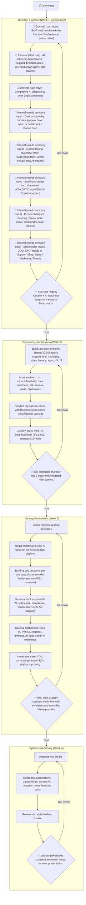

```mermaid
flowchart TD
    P["📦 ai-strategy"] --> WS1

    subgraph WS1["Baseline & context (Week 1, compressed)"]
        direction TB
        WS1n1["🔎 External (start now) · SaaS cost benchmarks by function (% of revenue, typical ratios)"]
        WS1n2["🔎 External (start now) · AI efficiency benchmarks: support deflection rates, dev productivity gains, ops savings"]
        WS1n1 --> WS1n2
        WS1n3["🔎 External (start now) · Competitive AI adoption by peer SaaS companies"]
        WS1n2 --> WS1n3
        WS1n4["🏢 Internal (needs company input) · Cost structure by function (approx. % of opex; or headcount + loaded cost)"]
        WS1n3 --> WS1n4
        WS1n5["🏢 Internal (needs company input) · Current tooling inventory: which SaaS/cloud tools, which already ship AI features"]
        WS1n4 --> WS1n5
        WS1n6["🏢 Internal (needs company input) · Existing AI usage incl. shadow AI (ChatGPT/Claude/GitHub Copilot adoption)"]
        WS1n5 --> WS1n6
        WS1n7["🏢 Internal (needs company input) · Process hotspots: recurring manual work, known bottlenecks, ticket volumes"]
        WS1n6 --> WS1n7
        WS1n8["🏢 Internal (needs company input) · Stakeholder inputs: COO, CFO, Heads of Support / Eng / Sales / Marketing / People"]
        WS1n7 --> WS1n8
        WS1X{"✅ exit: cost map by function + AI-readiness snapshot + external benchmarks."}
        WS1n8 --> WS1X
    end

    subgraph WS2["Opportunity identification (Week 2)"]
        direction TB
        WS2n1["Build use case inventory (target 20-30) across support, eng, marketing, sales, finance, legal, HR, IT"]
        WS2n2["Score each on: cost impact, feasibility, data readiness, risk, time-to-value, capex/opex"]
        WS2n1 --> WS2n2
        WS2n3["Shortlist top 5-8 use cases with rough business cases (assumptions labeled)"]
        WS2n2 --> WS2n3
        WS2n4["Classify: quick wins (<3 mo), build bets (3-12 mo), strategic (12+ mo)"]
        WS2n3 --> WS2n4
        WS2X{"✅ exit: prioritized shortlist + top-3 quick wins validated with owners."}
        WS2n4 --> WS2X
    end

    subgraph WS3["Strategy formulation (Week 3)"]
        direction TB
        WS3n1["Vision, mission, guiding principles"]
        WS3n2["Target architecture: how AI lands on the existing data platform"]
        WS3n1 --> WS3n2
        WS3n3["Build vs buy decisions per use case cluster (vendor landscape from WS1 research)"]
        WS3n2 --> WS3n3
        WS3n4["Governance & responsible AI: policy, risk, compliance, vendor risk, EU AI Act mapping"]
        WS3n3 --> WS3n4
        WS3n5["Talent & enablement: roles (AI PM, ML engineer, prompt/LLM ops), center-of-excellence"]
        WS3n4 --> WS3n5
        WS3n6["Investment case: TCO, cost savings model, ROI, payback, phasing"]
        WS3n5 --> WS3n6
        WS3X{"✅ exit: draft strategy sections, each internally consistent and quantified where possible."}
        WS3n6 --> WS3X
    end

    subgraph WS4["Synthesis & delivery (Week 4)"]
        direction TB
        WS4n1["Integrate into D1-D6"]
        WS4n2["Stress-test assumptions: sensitivity on savings %, adoption ramp, licensing costs"]
        WS4n1 --> WS4n2
        WS4n3["Review with stakeholders; finalize"]
        WS4n2 --> WS4n3
        WS4X{"✅ exit: all deliverables complete, reviewed, ready for exec presentation."}
        WS4n3 --> WS4X
    end

    WS1X -- "pass" --> WS2
    WS2X -- "pass" --> WS3
    WS3X -- "pass" --> WS4
    WS1X -- "fail: revise" --> WS1n1
    WS2X -- "fail: revise" --> WS2n1
    WS3X -- "fail: revise" --> WS3n1
    WS4X -- "fail: revise" --> WS4n1
```

_Auto-generated 2026-08-30 from build-plan.md by scripts/gen_flowchart.py — re-run to refresh, commit the change._